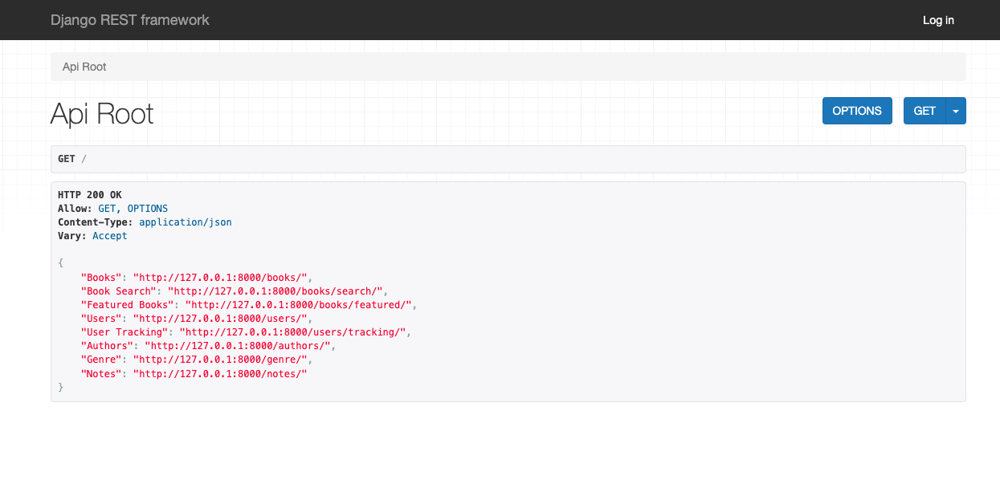
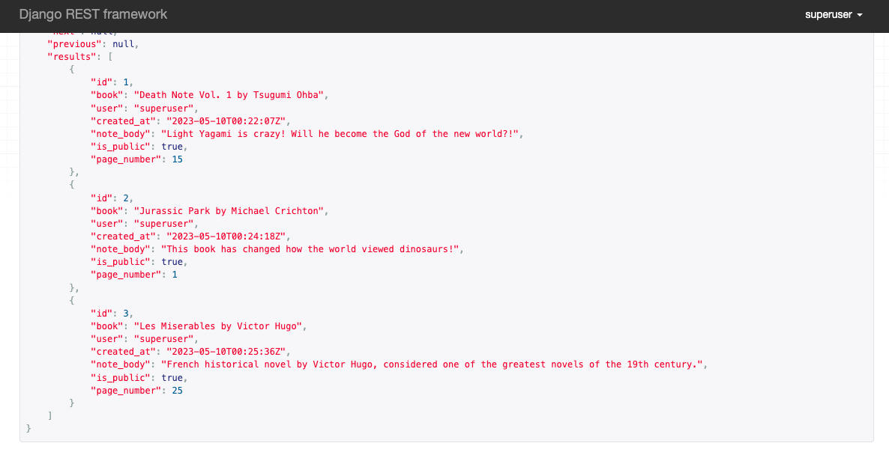

## Library App

API application that lets users keep track of books, including important information like title, author, publication date, a genre, and a field that marks it as "featured".

- list all books
- list all featured books
- create a book
- retrieve details about a book
- search books by author or title
- see a list of all the books they are tracking and their statuses
- mark a book as want to read, reading, or read
- update the want to read/reading/read status of a book
- see a list of all their books by status (e.g., all the books they have marked as "read")
- retrieve all their own private notes for a book
- retrieve all public notes for a book
- create a note for a book
- edit their own notes

Admin users can:

- update a book (including marking/unmarking it as featured)
- delete a book (this should not delete notes about a book)

